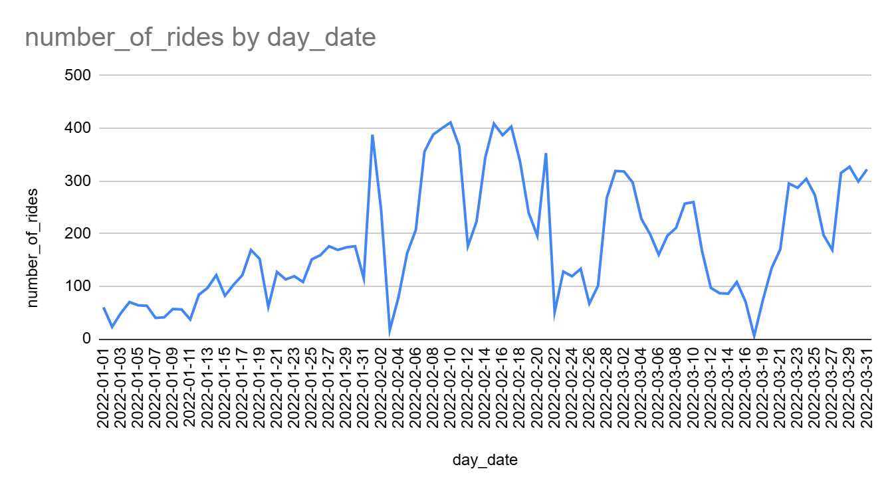
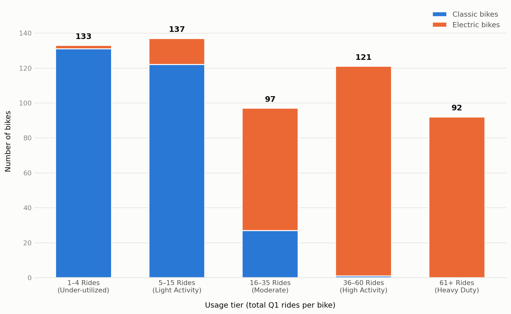
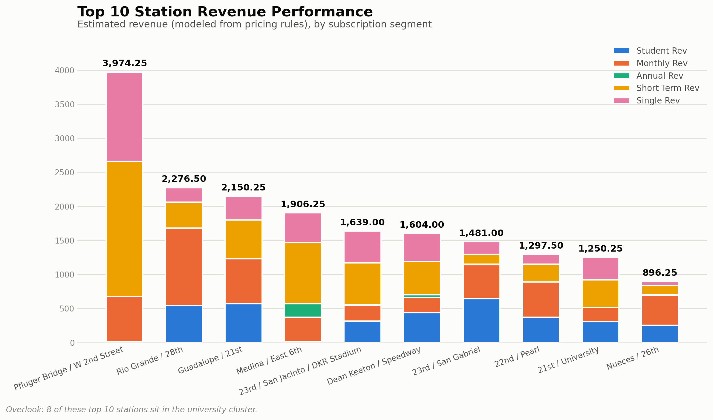
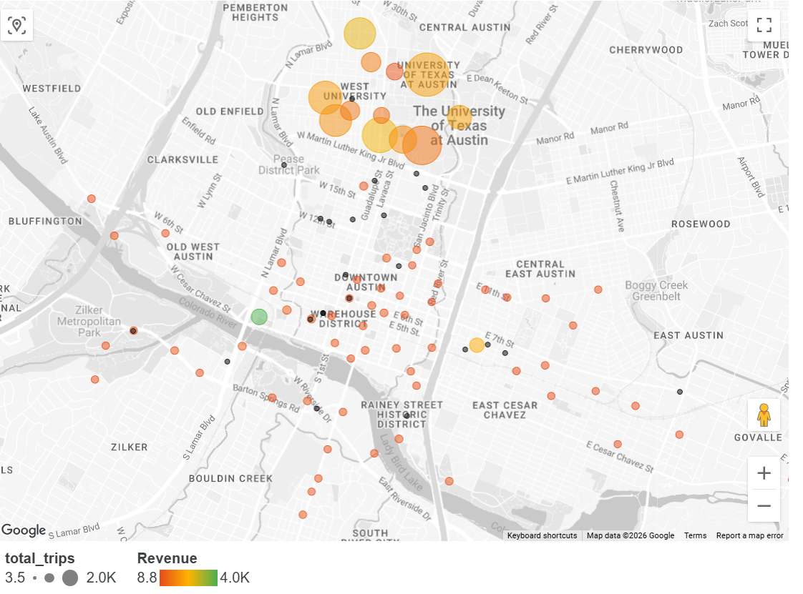
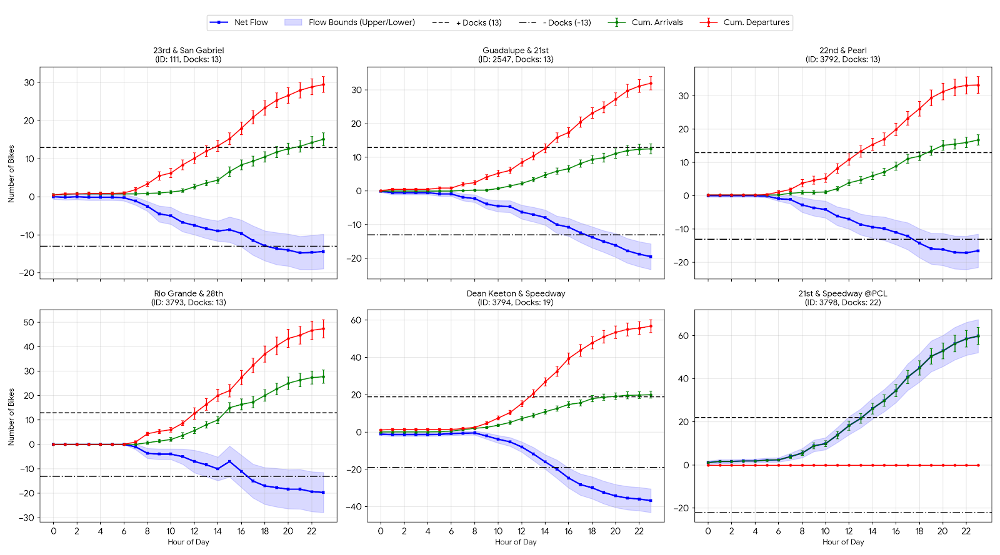
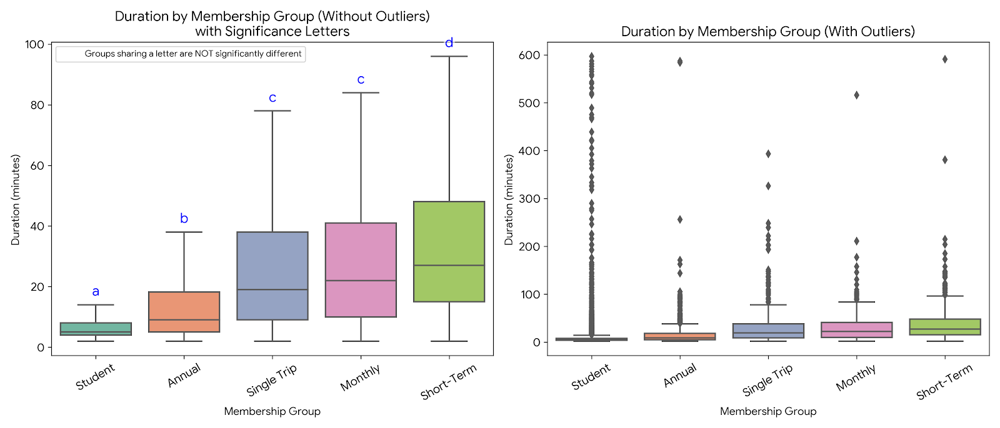
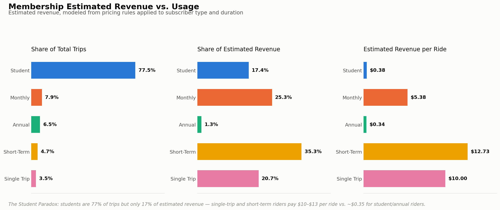
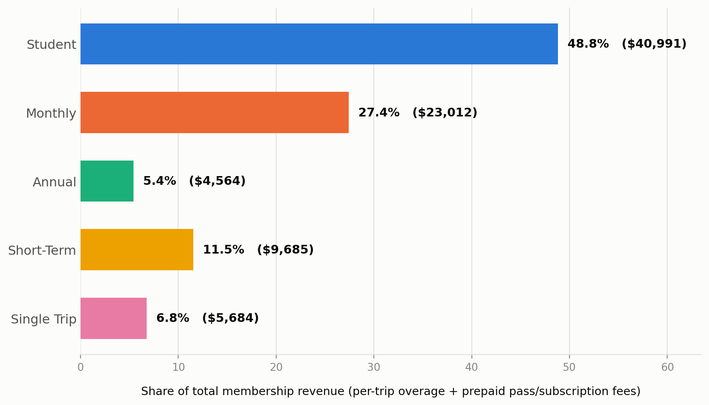
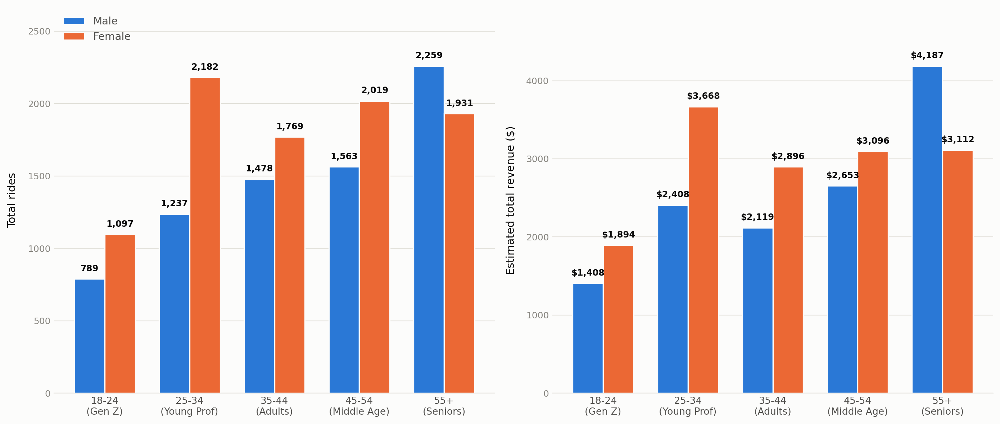

# Zen City Q1 2022 — Findings

This is the results write-up for the [SQL pipeline](./zen_city_bikeshare_analysis.sql): what the queries actually found, with the real numbers behind each claim, organized around the business questions the project set out to answer. Section and query references (e.g. "Part B.1", "Part E.1") point at the matching section of the SQL file.

**A note on tooling.** Every aggregation, join, and window-function calculation below runs in BigQuery. The one exception is the Kruskal-Wallis/Mann-Whitney significance testing in Section 4, run downstream in python on BigQuery's exported aggregates (BigQuery has no built-in significance-testing function).

---

## Section 1 — Data Quality: Cleaning a Messier-Than-Expected Dataset

Before any business question could be answered honestly, the raw data needed real repair work — this section documents what was actually wrong with it, since every later result depends on these fixes.

**Station IDs didn't match between tables.** Joining `rentals` to `station_info` on station ID alone produced null matches. Widening the join to also try matching on station *name* revealed why: distinct station counts shifted from 81 (grouping by ID) to 82 (grouping by ID *and* name) to 85 (after the three-way join) — a strong signal that some stations were using more than one ID, and some IDs were shared across stations that shouldn't share one. Ten separate ID problems were found and manually mapped (documented in full in Part B.1 of the SQL file), including two stations whose IDs had been fully **swapped with each other** — 4th/Sabine and Dean Keeton/Speedway.

**Station naming and addresses needed standardization.** Street names used inconsistent conventions ("22nd 1/2" vs. "22.5"), and separator symbols (`&`, `@`) needed unifying to a single `/` format. Separately, a handful of station addresses in the source table held **corporate sponsorship labels instead of real addresses** (e.g. "Presented by Whole Foods" instead of a street address) — these were manually restored to real addresses so the stations could be placed correctly for the geographic analysis in Section 3.

**Two stations were silently missing entire months of data.** Not flagged as errors — they just looked unusually quiet unless checked month-by-month: **28th/Rio Grande** (station ID 3793) has zero rides of any kind in March, and **22nd/Pearl** (ID 3792) has zero *starting* rides in January.

**Ride volume follows the university calendar, almost exactly.**

Splitting the quarter into three periods makes the pattern explicit: during **Winter Break** (Jan 1–17), the system averaged just 68.7 rides/day and many days didn't clear 50 rides at all. The moment spring semester classes began (Jan 18), ridership instantly spiked to 169 rides that day, and the **Semester Ramp-Up** period (Jan 18–31) averaged 140 rides/day — roughly double. By **Full Spring Operations** (Feb 1–14), the average reached 268.8 rides/day — quadruple the Winter Break baseline. Given that the largest single subscriber group in the data is students (see Section 4), this tracks the university calendar closely enough to treat as the dominant seasonal driver, rather than a coincidence.

A handful of specific days also dropped anomalously low, all traceable to real external events rather than data problems: **Jan 2** (23 rides — the Sunday after New Year's, compounded by a winter storm), **Feb 3** (17 rides) and **Feb 22** (51 rides) (both severe North American winter storm days), and **March 17** (missing entirely — a tracking/system outage, the only date completely absent from the dataset) followed by **March 18** (6 rides, the start of spring break). These anomaly days are explicitly excluded from the net-flow risk model in Section 3, so a storm doesn't get mistaken for a chronic operational problem.

**Raw ride duration is heavily right-skewed:** 30% of all rides last under 5 minutes.

---

## Section 2 — Fleet Utilization: Is the Bike Mix Right?

**The current fleet is nearly evenly split by bike count, but not by ride volume.** The system has 281 classic bikes and 299 electric bikes — a near-even count — but those classic bikes accounted for only 2,044 rides total, versus 14,541 rides on electric bikes. Electric bikes are handling roughly seven times the ride volume on a nearly identical-sized fleet.

Bucketing every individual bike (by its own lifetime ride count, Part D.2 of the SQL) into five usage tiers sharpens this further: **23% of the entire fleet falls into the bottom "1–4 rides" under-utilized tier, and that tier is almost entirely classic bikes (131 of 133, 98.5%)**. At the other end, the "Heavy Duty" (61+ rides) tier is 92 bikes, and all but one of them are electric.

**Is this a demand problem, or a placement problem?** Before recommending a fleet-mix change, it's worth ruling out a simpler explanation: maybe classic bikes aren't less wanted, they're just parked at quiet stations where no bike would get much use. Tracing each bike's most recent trip to find where it was last parked (Part D.3 of the SQL) and comparing that against how busy that station is overall tests this directly. The result rules the simpler explanation out: classic and electric bikes are parked across the system's four station-traffic quartiles in almost identical proportions (about 51% of each bike type were last seen at the busiest quarter of stations, versus roughly 9% and 7% respectively at the quietest) — so classic bikes are not disproportionately stuck in quiet corners of the system. Yet **73% of under-utilized classic bikes (96 of 131) are last seen at the two busiest quartiles of stations**, right alongside the electric bikes that are racking up far more rides in those same locations. Classic bikes get little use even where station traffic — and presumably rider choice between bike types — is highest, which points to a genuine rider preference for electric over classic rather than a fixable placement or redistribution problem.

The fleet mix does not reflect observed demand — the data supports increasing the electric-bike share while keeping a smaller allocation of classic bikes specifically for recreational/short-distance use, where their lower cost per ride still makes sense.

---

## Section 3 — Station Usage and Operational Flow

### Which stations are commuter-driven vs. recreational?

Each station was profiled (Part E.2 of the SQL) using its own hour-of-day and day-of-week usage pattern: a **Pure Commuter** station has more rush-hour trips than midday trips and a weekend ratio under 0.20; a **Casual/Recreational** station has a weekend ratio of 0.35 or higher; everything else is **Hybrid/Mixed Use**.

*(Revenue here is modeled from the pricing rules in Part B of the SQL applied to each trip's subscriber type and duration — there's no observed billing data in this dataset, so every figure on this chart is an estimate, not a recorded charge.)*

**8 of the top 10 highest-revenue stations sit in the university cluster.** The two exceptions are the more interesting finding. **Pfluger Bridge/W 2nd St** is the single highest-revenue station in the whole system (an estimated $3,974) despite only 484 total rides — its weekend ratio of 0.38 places it firmly in the recreational category, and its revenue mix (dominated by Short-Term and Single-Trip riders, barely any Student revenue) fits a tourist/leisure profile rather than a commuter one — it earns more per ride, from fewer, higher-paying riders. **Medina/East 6th** has even fewer rides (408, the lowest ride count of any top-10 station) yet still lands 4th by revenue, and is the only top-10 station with meaningful Annual-membership revenue (an estimated $200, several times any other top-10 station); it also has a high weekend ratio and sits in the heart of East Austin's nightlife district, consistent with a recreational profile as well.

At the *station* level, no single membership group dominates revenue across the board the way Students dominate raw trip volume system-wide (Section 4): among these 10 stations, Short-Term riders are the largest revenue segment at 4 of them, Monthly riders at another 4, and Students at just 1 (23rd/San Gabriel) — a reminder that a station's top-line revenue and *why* it earns that revenue are two different questions.

**A concrete link back to the net-flow risk model:** 7 of these 10 highest-revenue stations already carry a "Critical" operational warning from the station-warnings query (Part E.2) — Pfluger Bridge, Guadalupe/21st, 23rd/San Gabriel, and 22nd/Pearl as chronic bike-shortage risks, and Rio Grande/28th and Nueces/26th as dock-gridlock risks. In plain terms: the stations generating the most revenue are disproportionately the same ones under the most operational strain, which sharpens the earlier rebalancing recommendation — these are exactly the stations where getting rebalancing right pays off most directly.

The station network map below puts this in geographic context: each station is placed at its real street location, sized by total Q1 trip volume and colored by estimated revenue (red = lowest, green = highest). The university corridor jumps out immediately as a dense cluster of large, orange-to-yellow bubbles — high trip volume translating into consistently strong revenue across several adjacent stations — while Pfluger Bridge stands apart from that cluster entirely: a lone green (top-of-scale revenue) bubble by the river well outside the university footprint, visually confirming the earlier point that it earns its revenue from a completely different rider profile than the university stations around it.

*(Built in Google Looker Studio (formerly Data Studio) from the same station-level query output as the table above; bubble size is total Q1 trips, color is estimated revenue. [View the interactive version →](https://datastudio.google.com/s/k7qLwN-MR6A))*

### Net flow and rebalancing risk

**Business question:** which stations create the most operational pressure by chronically emptying out or filling up? Rebalancing bikes between stations is a real labor cost, so pinpointing exactly where and when it happens matters operationally.

The model (Part E.1) is built in five steps to avoid two specific statistical traps: **survivorship bias** (an hour with zero rides needs to be recorded as a true zero, not silently dropped as a missing row, or the remaining hours' averages get inflated) and **anomaly contamination** (a single severe storm day shouldn't get treated as a "typical" hourly pattern). Concretely: a full hour-by-hour calendar grid is built per station, restricted to that station's own active lifespan; any calendar day with fewer than 60 system-wide rides is dropped entirely (this removes the storm and outage days identified in Section 1); historical hourly net-flow averages and their standard errors are computed per station/day-of-week/hour; those are summed into a cumulative running balance across the day; and the hourly standard errors are propagated (root sum of squares) into a 95% confidence interval on that cumulative balance. The analysis is scoped to February–March only, since January's Winter Break pattern is a different regime entirely (Section 1).

**The result is a clear, structural imbalance.** Across a meaningful share of stations — including ones that handle real volume on both ends — the cumulative net flow trends steadily toward one boundary or the other across the day rather than oscillating around zero. In practice, some stations repeatedly behave as "sinkholes" (bikes accumulate, rarely leave) and others as chronic deficits (bikes drain out and aren't replaced). This is a real, ongoing cost driver, not a one-off event.

*Limitation: the dataset has no record of the company's own rebalancing activity — staff or trucks physically moving bikes between stations — so this model measures relative demand pressure (how far a station's balance would drift if nothing intervened), not a validated, absolute "ran out of bikes/docks" event, since any real intervention during the day isn't visible in this data.*

**Business recommendations:** conduct field reviews to understand *why* the most important stations consistently function as sinkholes or deficit points (station geometry, nearby demand generators, etc.), and consider time-based incentives for riders who return bikes to deficit stations during high-need hours, to reduce manual rebalancing costs.

Separately, the station-usage findings point to a few more targeted actions: consider consolidating the persistently underused, low-value stations rather than staying this spread out; reopen or better-promote closed stations near campus (e.g. Pease Park) that may simply be under-known rather than genuinely low-demand; and specifically promote weekend/recreational usage from campus-area riders toward high-performing leisure destinations like Pfluger Bridge/W 2nd. A number of customers list a downtown address but downtown station usage is comparatively low — worth a targeted awareness push rather than assuming lack of demand.

---

## Section 4 — Customer Segments, Ride Behavior, and Estimated Revenue

### Are ride-duration differences between segments real?

Subscriber types were grouped into 5 membership categories (Annual, Monthly, Short-Term, Single Trip, Student) based on billing logic and usage intent (full mapping in Part B.1 of the SQL). A Kruskal-Wallis test across the five groups' ride durations came back highly significant (chi-squared = 3,442.16, p < 0.001), and a Bonferroni-corrected post-hoc Mann-Whitney U test confirmed which specific groups differ from each other.

**Student rides are dramatically shorter than every other segment** (median around 5 minutes) and statistically distinct from all other groups. Single-Trip and Monthly riders form a middle tier that isn't statistically distinguishable from each other, while Short-Term (tourist/leisure pass) riders have the longest typical rides of all. This is a real behavioral pattern, not noise: student trips look like quick, functional campus hops, while short-term/tourist trips look like genuine leisure rides.

### The "Student Paradox"

*(Estimated revenue, modeled from pricing rules — see the note under the Section 3 revenue chart above.)*

Students account for **77.5% of all trips** but only **17.4% of total estimated revenue** — the opposite of what trip volume alone would suggest. The gap comes down to how little students pay per ride: at $0.38 in modeled revenue per ride (nearly all of it inside their 60-minute free window), a student ride is close to a break-even event for the system. Annual members sit in the same range ($0.34/ride) for the same reason. Short-Term and Single-Trip riders are a different story entirely — with no subscription to offset the cost, they pay $12.73 and $10.00 per ride respectively, roughly **30 times** the student/annual rate — and together account for over half of total estimated revenue (56.0%) from just 8.2% of trips. Monthly riders sit in between on both counts ($5.38/ride, 25.3% of revenue from 7.9% of trips). The practical read: **students are the system's operational backbone, not its revenue engine** — real per-ride monetization is concentrated almost entirely in Short-Term and Single-Trip riders, and a strategy built only around the loudest volume signal (student ridership) would miss where the money actually comes from.

**That per-ride view isn't the whole revenue story, though.** The chart above is built entirely from per-trip overage charges — it doesn't include what riders pay upfront for their membership itself (the student pass fee, the monthly pass fee, the annual pass fee). Adding that in requires two separate pieces: the real per-trip revenue by group (unchanged from the chart above), plus how many members were actively paying for each plan and what that plan costs — Student and Annual passes are billed once (483 and 28 current members respectively, from Part F.1), while a Monthly pass is billed every month a rider holds it, so it needs its own month-by-month active-member count (Part F.3) rather than a single snapshot — 200 members in January, 246 in February, 197 in March, for 643 billed member-months total. At $75/student pass, $25/month, and $150/year:

*(Per-trip revenue by group, plus each group's real active-member count times its actual pass price — see Parts F.1 and F.3 of the SQL. This is a genuinely different question from the per-ride chart above, not a contradiction of it.)*

Seen this way, Students account for an estimated **48.8%** of total membership revenue ($40,991 of $83,936) — nearly half, even though they're a near-break-even segment per ride, simply because 483 students are each paying a $75 pass fee. **Monthly riders are the more surprising story here:** their per-trip revenue alone is a modest $6,937 (16.8% of the per-trip-only total), but 643 billed member-months at $25 each adds $16,075 in subscription revenue — more than double their own ride revenue — pushing Monthly from a secondary segment to the **second-largest revenue source overall at 27.4%**. Short-Term, Single-Trip, and Annual make up the remainder (11.5%, 6.8%, and 5.4%).

*(This total is built from real per-trip revenue plus real active-member counts, deliberately not by attributing each customer's entire revenue history to a single "current membership" label — Part F.1's own logic shows why that label alone isn't reliable enough to build a revenue split on: a meaningful number of customers appear to switch across all five membership groups within days of each other, far more than real behavior would produce. `customer_id` is a synthetic add-on to the underlying public Austin B-cycle dataset this project is built on — it has no real customer-level tracking — and appears to have been assigned per ride without regard to that ride's own subscriber type, which is the most likely source of this pattern.)*

**Both things are true at once:** students are a near-break-even segment on a per-ride basis, and they are simultaneously the largest single source of total revenue once pass fees are counted — and Monthly membership fees matter more to the bottom line than Monthly riders' actual usage would suggest. The practical read: retention of the student and monthly membership base matters a great deal to total revenue, even though most of that value shows up as subscription income rather than per-ride income.

### Who is actually riding, and who's most valuable?

**Women lead ride volume in nearly every age group under 55**, most visibly among Young Professionals (25–34): 2,182 trips for women versus 1,237 for men in that cohort — 76% more trips and 52% more estimated revenue from women in that specific age group. Ride duration itself is fairly stable across genders throughout the dataset, sitting in a roughly 12.4–14.5 minute band — so the volume gap is a difference in *how many people ride*, not *how they ride once they're on a bike*.

**Seniors (55+) are a surprisingly strong, easily overlooked segment.** Combined, senior riders generated 4,190 trips and over $7,200 in estimated revenue — and senior men specifically are the single highest-revenue sub-segment in the entire dataset ($4,187), driven by real ride volume and one of the longest average ride durations of any group (14.2 minutes, behind only 25-34 and 18-24 men).

**Recommendations:** because ride duration is uniform across genders, the lower total revenue from younger male riders reads as an acquisition gap, not a usage-pattern problem — targeted growth marketing aimed at young male professionals and Gen Z men is the more direct lever than trying to change on-bike behavior. Separately, since seniors are already a substantial, highly active, premium-revenue segment, retention efforts and potential community partnerships aimed at that group are worth exploring to sustain it.
